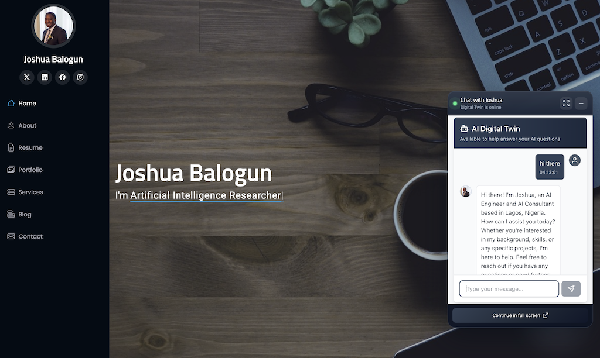

<div align="center">
 <h1> AI Digital Twin Application </h1>
</div>

<br/>

<div align="center">
A production-ready, full-stack AI Digital Twin that represents **Joshua Balogun** in real-time conversations.

This project combines a modern Next.js frontend with a FastAPI backend powered by **AWS Bedrock** and deploys to AWS using **Lambda + API Gateway + S3 + CloudFront + Terraform**.

Production URL: https://d36qx0izkd71ph.cloudfront.net/

<br />


<br/>



</div>

## Overview

This application enables visitors to chat with an AI twin trained on curated profile data, communication style, and professional context. The twin responds in a conversational, professional tone and supports lightweight lead-capture workflows through built-in tool use.

The backend includes memory persistence by session, Bedrock tool-calling, and optional integrations for notifications and email follow-up.

## Tech Stack

### Frontend
- **Next.js 16** (App Router, static export)
- **React 19**
- **TypeScript 5**
- **Tailwind CSS 4**
- **Lucide React** icons

### Backend
- **FastAPI**
- **AWS Bedrock Runtime** (`converse` API)
- **Mangum** (Lambda adapter)
- **Boto3**
- **Pydantic**
- **Python-dotenv**
- **SendGrid** (optional email tool)
- **Pushover** (optional notification tool)

### Infrastructure & Deployment
- **AWS Lambda** (Python 3.12 runtime)
- **Amazon API Gateway (HTTP API)**
- **Amazon S3** (frontend hosting + memory storage)
- **Amazon CloudFront**
- **Terraform** (IaC)
- **Docker** (Lambda-compatible packaging step)

## Core Features

- Conversational AI Digital Twin experience
- Session-based conversation memory
- Memory persistence to local files or S3
- Bedrock tool-calling loop with guarded execution
- Structured context injection from profile files
- Hidden reasoning sanitization in backend and frontend
- Optional lead capture + unknown-question logging tools
- Optional email dispatch via SendGrid
- Optional push notifications via Pushover
- Static frontend export optimized for S3 + CloudFront
- Terraform-based environment-aware infrastructure deployment

## Architecture

```text
[User Browser]
   |
   v
[CloudFront]
   |
   v
[S3 Static Frontend (Next.js export)]
   |
   | POST /chat
   v
[API Gateway HTTP API]
   |
   v
[AWS Lambda (FastAPI via Mangum)]
   |
   +--> [AWS Bedrock Runtime]
   |
   +--> [S3 Memory Bucket] (if USE_S3=true)
   |
   +--> [SendGrid / Pushover] (optional tools)
```

## Project Structure

```text
twin/
├── backend/
│   ├── server.py              # FastAPI API + Bedrock orchestration + tools
│   ├── lambda_handler.py      # Mangum Lambda entrypoint
│   ├── context.py             # System prompt construction
│   ├── resources.py           # Loads profile context files
│   ├── deploy.py              # Builds Lambda deployment zip
│   ├── data/                  # facts, summary, style, LinkedIn PDF
│   ├── requirements.txt
│   └── pyproject.toml
├── frontend/
│   ├── app/
│   │   ├── layout.tsx
│   │   └── page.tsx
│   ├── components/
│   │   └── twin.tsx           # Chat UI component
│   ├── public/
│   │   └── avatar.png
│   ├── next.config.ts         # static export config
│   └── package.json
├── terraform/
│   ├── main.tf                # AWS resources
│   ├── variables.tf
│   ├── output.tf
│   └── prod.tfvars
├── scripts/
│   ├── deploy.sh              # build + terraform apply + frontend publish
│   └── destroy.sh             # teardown helper
└── .env.example
```

## API Endpoints

- `GET /` - API metadata
- `GET /health` - Health/status endpoint
- `POST /chat` - Chat with digital twin
- `GET /conversation/{session_id}` - Retrieve saved conversation history

### `POST /chat` request example

```json
{
  "message": "Tell me about your AI engineering background",
  "session_id": "optional-session-id"
}
```

### `POST /chat` response example

```json
{
  "response": "I’ve spent years building and deploying AI systems...",
  "session_id": "generated-or-existing-session-id"
}
```

## Environment Variables

Create a root `.env` file for local development and deployment scripts.

### Required (core)

- `DEFAULT_AWS_REGION` - AWS region for Bedrock/Lambda interactions
- `BEDROCK_MODEL_ID` - Bedrock model id (example: `global.amazon.nova-2-lite-v1:0`)
- `CORS_ORIGINS` - Comma-separated allowed origins
- `USE_S3` - `true` or `false` for conversation memory backend
- `S3_BUCKET` - Memory bucket name (required when `USE_S3=true`)
- `MEMORY_DIR` - Local memory folder path when `USE_S3=false`
- `NEXT_PUBLIC_API_URL` - Frontend target API URL

### Optional (tool integrations)

- `SENDGRID_API_KEY`
- `SENDGRID_SENDER_EMAIL`
- `RECIPIENT_EMAIL`
- `PUSHOVER_TOKEN`
- `PUSHOVER_USER`

### Bootstrap template

```env
# AWS Configuration
AWS_ACCOUNT_ID=your_12_digit_account_id
DEFAULT_AWS_REGION=us-east-1

# Project Configuration
PROJECT_NAME=twin
```

## Local Development

### 1. Clone and install dependencies

```bash
git clone <your-repo-url>
cd twin

# frontend
cd frontend && npm install && cd ..

# backend (option A: uv)
cd backend && uv sync && cd ..

# backend (option B: pip)
cd backend && pip install -r requirements.txt && cd ..
```

### 2. Configure environment

- Copy `.env.example` to `.env` and populate values.
- For local frontend development, set `NEXT_PUBLIC_API_URL=http://localhost:8000`.

### 3. Run backend

```bash
cd backend
uv run server.py
# or
uvicorn server:app --host 0.0.0.0 --port 8000 --reload
```

### 4. Run frontend

```bash
cd frontend
npm run dev
```

Open `http://localhost:3000`.

## Deployment (AWS)

### Prerequisites

- AWS CLI authenticated (`aws configure` / SSO)
- Terraform installed
- Docker installed (used to package Lambda dependencies)
- Node.js + npm
- Python tooling (`uv` or pip)
- The deployment script creates the Terraform remote state bucket (`twin-terraform-state-<aws-account-id>`) if it does not already exist; state locking uses an S3 lockfile, so no DynamoDB lock table is required.

### Deploy

```bash
./scripts/deploy.sh prod twin
```

This script will:
- Build `backend/lambda-deployment.zip`
- Initialize/select Terraform workspace
- Provision or update AWS infrastructure
- Build static frontend export
- Sync frontend build to S3

### Destroy environment

```bash
./scripts/destroy.sh prod twin
```

## Social Links

- LinkedIn: https://linkedin.com/in/joshuabalogun
- GitHub: https://github.com/iJoshy

## Security & Reliability Notes

- CORS is explicitly configured in backend middleware
- Tool execution is constrained to known handlers
- Assistant reasoning blocks are stripped before rendering
- Conversation history can be isolated per session ID
- Infrastructure is reproducible via Terraform workspaces (`dev`, `test`, `prod`)

## Roadmap Ideas

- Authentication layer for protected conversations
- Analytics and observability (CloudWatch dashboards, tracing)
- Cost controls for Bedrock calls and request throttling refinement
- Rich profile management UI for editing twin persona data
- Automated test suite for chat, tools, and infra validation

## Credits

Inspired by production-grade AI app patterns and adapted to a Digital Twin use case for Joshua Balogun.
